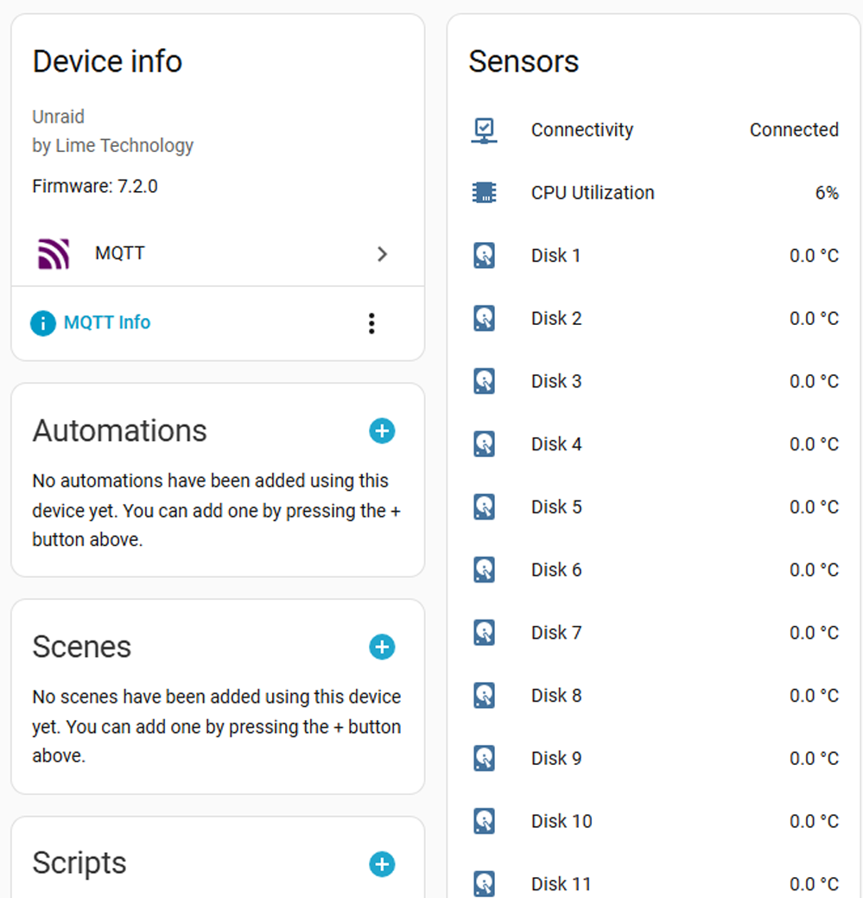
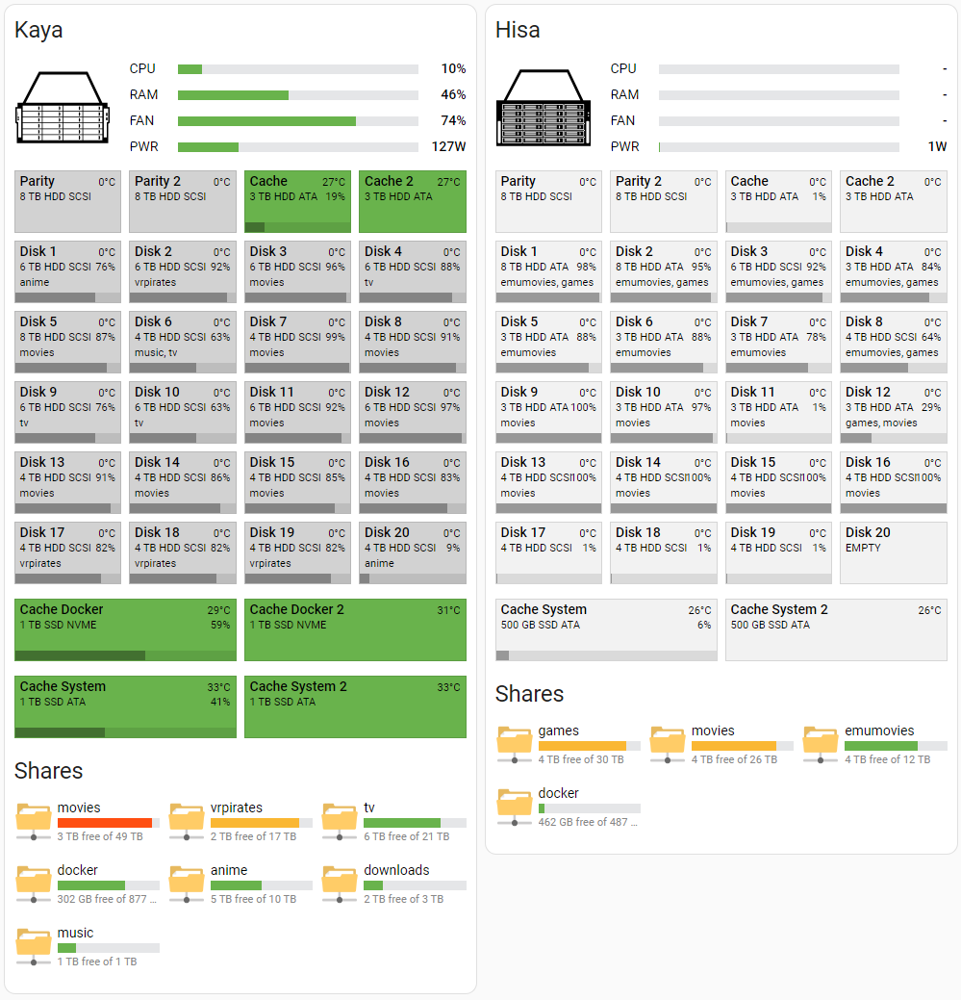
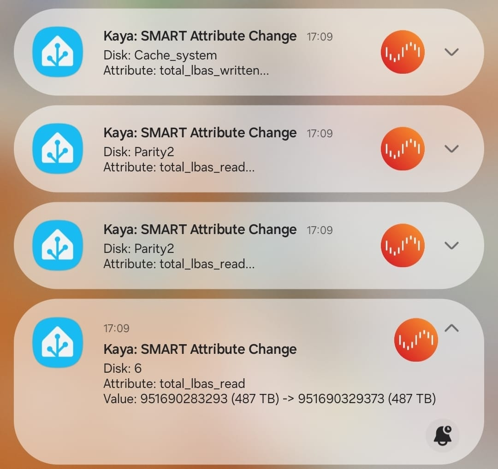

<div align="center">
  
</div>


> ## ⚠️ Breaking changes
> UnRAID 7.2.0 introduced a GraphQL API. While this is fantastic news, it also comes with breaking changes. I’ve tried to make this integration as backwards-compatible as possible.
>
> - If you are still on UnRAID 7.0–7.1, use the latest `1.x.x` Docker image.
> - Users of UnRAID 7.2.0+ can use any `2.x.x` image or simply `:latest` (which always points to the newest release).
> - 2.x.x releases now require an Unraid GraphQL API Key (Viewer role). Create one in Unraid (Settings → Management Access → API Keys) and set it as `api_key` in your `config.yaml`. See the instructions in the README: [Important: Requirements and version support](#important-requirements-and-version-support).
> - For 2.x.x, you will need to update the Lovelace button-card templates. Copy the updated files from `/lovelace/templates/` in this repo into your Home Assistant config (e.g., `/config/lovelace/templates/button_card/`), then reload resources or restart Home Assistant.
>
> Recommended: delete the MQTT device this integration created and reboot the container once after updating to clear out old sensors and avoid duplicate/renamed entities.  
> In Home Assistant, go to Settings → Devices & Services → MQTT, find your server’s device, and delete it using the three-dots menu (or the “MQTT info” link on the device page), then restart the container.


# Unraid to Home Assistant

This Docker container integrates with your Unraid server by leveraging both the GraphQL API and legacy WebSocket/HTTP endpoints to gather relevant data. It then forwards this information to Home Assistant via MQTT so you can build dashboards that provide a better overview than Unraid’s native UI.


# Features

1. Historical data is crucial! Monitor CPU, RAM, network, disk temperatures, and more over time — including how often and when disks spin up.
2. Enable Unraid automations via Home Assistant. Get alerts for low disk space, fan failures, and more.
3. A custom view that makes it easier to locate disks in the array. Disks change color from grey (spun down) to yellow/red if overheating, with warnings for problem disks. Includes a parity/scrub running indicator.
4. Instantly see which shares are on which disks and how full each disk is.
5. A “network-share” view in Home Assistant that’s more intuitive than Unraid’s Shares tab.
6. SMART alerts for critical attribute changes — including SAS drives, which Unraid doesn’t natively notify about.


<div align="center">
  <a href="extras/mqtt_entities.png">
    
  </a>
  <a href="extras/screenshot.png">
    
  </a>
</div>


## Important: Requirements and version support

- Unraid 7 or later is required.
- API Key is required for GraphQL access:
  - In Unraid, go to Settings → Management Access → API Keys → Create API Key → Create New.
  - Give it a name (e.g., “Home Assistant”) and select the “Viewer” role, then create.
- Username and password are still required because not all data sources are available via GraphQL yet (e.g., some legacy channels, SMART enrichment, share details, GPU plugin stats).
- Docker image tags:
  - Unraid 7.0–7.1: use the latest `1.x.x` image tag.
  - Unraid 7.2.0 or later: use any `2.x.x` image tag or simply `:latest`.
  - The `:latest` tag will always point to the newest release.


## Prerequisites

- Home Assistant and an MQTT broker set up and working.
- Unraid 7+ with a Viewer-role API Key created (see steps above).
- Unraid username/password for legacy endpoints.

## Getting started

Create a `data` folder and place a `config.yaml` inside. Example with two servers (“Kaya” and “Hisa”); adjust MQTT accordingly:

```
unraid:
  - name: Kaya
    host: 192.168.1.10
    port: 80
    ssl: false
    username: root
    password: PASSWORD
    api_key: VIEWER_ROLE_API_KEY
    scan_interval: 30

  - name: Hisa
    host: 192.168.1.20
    port: 80
    ssl: true
    ssl_verify: false
    username: root
    password: PASSWORD
    api_key: VIEWER_ROLE_API_KEY
    scan_interval: 30

mqtt:
  host: 192.168.1.100
  port: 1883
  username: USERNAME
  password: PASSWORD
```

Now we can run our container either using `docker run` or `docker-compose`.

### Docker run

```bash
docker run -d \
  --name hass-unraid \
  --network bridge \
  --restart always \
  -e TZ=Europe/Oslo \
  -v $(pwd)/data:/data \
  ghcr.io/idmedia/hass-unraid:latest
```

### Docker-compose

```yaml
services:
  hass-unraid:
    container_name: hass-unraid
    network_mode: bridge
    restart: always
    environment:
      - TZ=Europe/Oslo
    volumes:
      - './data:/data'
    image: ghcr.io/idmedia/hass-unraid:latest
```

### Notes

- If you’re on Unraid 7.0–7.1, replace the image tag with your chosen `1.x.x` release (e.g., `ghcr.io/idmedia/hass-unraid:1.x.x`).
- On Unraid 7.2.0+, you can use `:latest` or pin a specific `2.x.x` tag.
- On first run, a device should appear in Home Assistant under Settings → Devices & Services → MQTT.  
  If nothing shows up, check the container logs: `docker logs hass-unraid`.

## Updating

It’s recommended to delete the MQTT device this integration creates before updating, as some entities may have been renamed or removed between versions. Then restart the container once.

Steps:
1. In Home Assistant, go to Settings → Devices & Services → MQTT.
2. Find your Unraid server’s MQTT device in the list.
3. Delete it using either:
   - The three-dots menu on the overview page, or
   - The “MQTT info” text link on the device page, then use the delete option there.
4. Restart the `hass-unraid` container.

## Lovelace

See the `lovelace` folder for two button-card templates and an example setup for “Kaya” like in the screenshot.

This example uses:
- [button-card](https://github.com/custom-cards/button-card)
- [vertical-stack-in-card](https://github.com/ofekashery/vertical-stack-in-card)
- [auto-entities](https://github.com/thomasloven/lovelace-auto-entities)
- [card-mod](https://github.com/thomasloven/lovelace-card-mod)

Copy the button-card templates from `/lovelace/templates/` into `/config/lovelace/templates/button_card/`:

```
network_share.yaml
simple_bar.yaml
unraid_disk.yaml
```

Ensure button-card finds the templates by adding this to the top of your `ui-lovelace.yaml`:

```yaml
button_card_templates: !include_dir_merge_named lovelace/templates/button_card
```

## Packages

If you want fan speed sensors or SMART attribute notifications, see the `packages` folder.  
“UnRaid Smart Data” caches SMART attributes for all disks, and “Notify on SMART Attribute Change” sends a notification if any defined attribute changes state — helpful for SAS drives where Unraid doesn’t notify on SMART attributes.


<div align="center">
  
</div>


## Contribute

Issues, PRs, and suggestions are welcome. If you find this useful, please consider starring the repo!

<a href="https://www.paypal.com/cgi-bin/webscr?cmd=_s-xclick&hosted_button_id=JPGHGTWP33A5L">
  
</a>